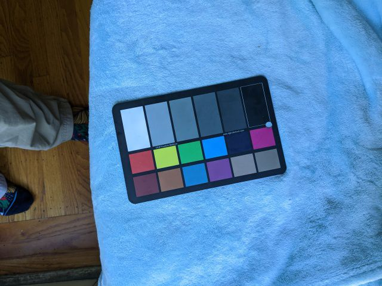
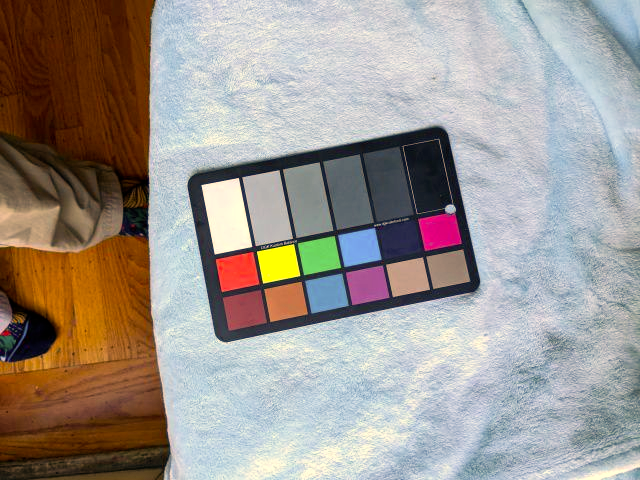
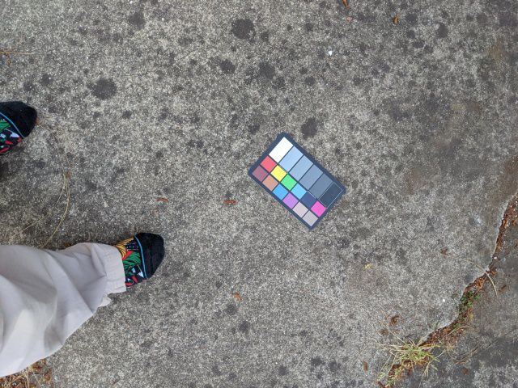
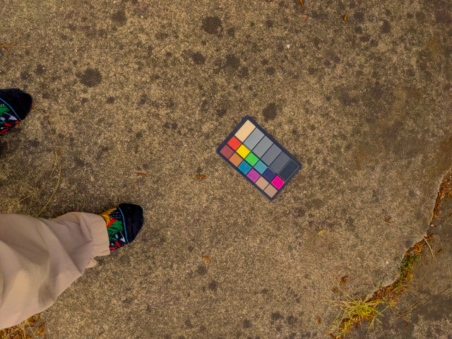
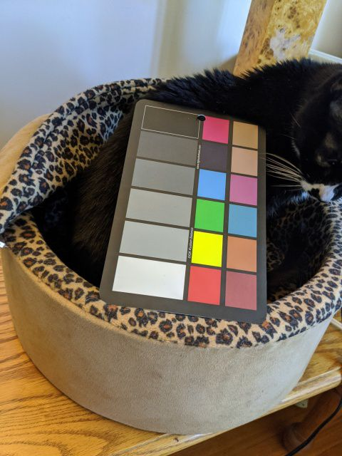
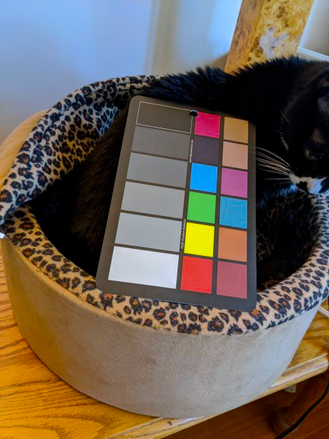
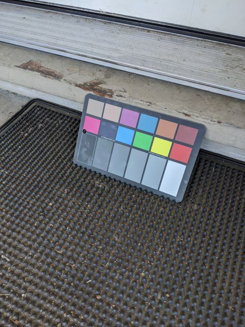
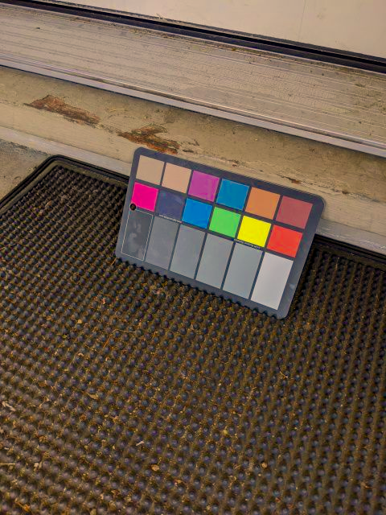

## Color calibration test

### Build the code & test

Before building the code, make sure the latest opencv_contrib project is built and the headers & lib files are installed to `/usr/local/`

```bash
$ mkdir build
$ cd build
$ cmake ../
$ make
# The test images are already packed in the repo
$ ./color_calibration_test -t=2 -nc=3 -f=./1.png
# Then check the calibrated image 1.calibrated.png
```

The original image(build/1.png):



The calibrated image(build/1.calibrated.png):



The original image(build/2.png):



The calibrated image(build/2.calibrated.png):




The original image(build/3.png):



The calibrated image(build/3.calibrated.png):




The original image(build/4.png):



The calibrated image(build/4.calibrated.png):


